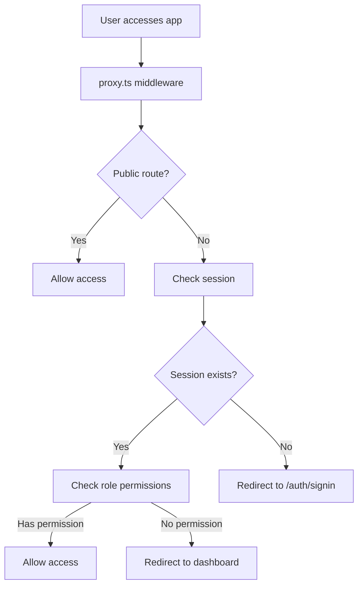

# Project Analysis and Recommendations

## Executive Summary

This document provides a comprehensive analysis of the Next.js 16 appointment booking system project, including detailed recommendations for completing the implementation. The project demonstrates a solid architectural foundation with well-organized code, but requires significant feature development to become a fully functional appointment booking system.

---

## 1. Technology Stack Analysis

### Core Technologies

| Technology | Version | Purpose |
|------------|---------|---------|
| **Next.js** | 16.1.6 | React framework with App Router |
| **React** | 19.2.3 | UI library |
| **Prisma** | 6.19.2 | ORM with PostgreSQL |
| **NextAuth.js** | 5.0.0-beta.30 | Authentication |
| **Tailwind CSS** | 4.1.18 | Styling |
| **TypeScript** | 5.x | Type safety |
| **Cypress** | 15.10.0 | E2E testing |

### Supporting Libraries

- **i18next** + **react-i18next**: Internationalization
- **next-i18n-router**: Locale-based routing
- **next-themes**: Dark/light mode
- **Radix UI**: Accessible UI primitives
- **lucide-react**: Icon library
- **class-variance-authority**: Component variants
- **bcryptjs**: Password hashing
- **zod**: Schema validation

### Assessment: ✅ Well-chosen modern stack

The technology selections are contemporary and appropriate for a production appointment booking system. Next.js 16 provides excellent performance and developer experience.

---

## 2. Project Structure Analysis

```
/
├── app/
│   ├── [lang]/              # Locale-prefixed routes
│   │   ├── auth/            # Authentication pages
│   │   │   ├── signin/
│   │   │   ├── signout/
│   │   │   └── signup/
│   │   ├── dashboard/       # Protected dashboard
│   │   ├── layout.tsx       # Root layout with providers
│   │   └── page.tsx         # Landing page
│   ├── actions/             # Server actions
│   ├── api/                # API routes
│   └── globals.css          # Global styles
├── components/
│   ├── ui/                 # Reusable UI components
│   ├── auth-nav.tsx
│   ├── locale-switcher.tsx
│   ├── theme-provider.tsx
│   └── theme-switcher.tsx
├── lib/
│   ├── auth/               # NextAuth configuration
│   ├── db/                 # Database connection
│   ├── generated/          # Prisma generated code
│   └── utils/              # Utility functions
├── prisma/
│   ├── schema.prisma       # Database schema
│   └── migrations/         # Database migrations
├── dictionaries/            # Translation files
└── plans/                  # Documentation
```

### Structure Strengths
- ✅ Clean separation of concerns
- ✅ Locale-based routing with `[lang]` parameter
- ✅ Server actions for form submissions
- ✅ Organized utility functions
- ✅ Type-safe database access with Prisma

### Structure Weaknesses
- ❌ No middleware.ts file (using proxy.ts for Next.js 16)
- ❌ Missing API routes for CRUD operations
- ❌ Limited component organization

---

## 3. Database Schema Analysis

### Models Overview

#### Organization Model
Multi-tenant support with organization-specific settings:

```prisma
model Organization {
  id             String           @id @default(cuid())
  name           String
  slug           String           @unique
  type           OrganizationType
  timezone       String           @default("Asia/Tehran")
  locale         String           @default("fa")
  themeMode      ThemeMode        @default(SYSTEM)
  primaryColor   String           @default("#0ea5e9")
  secondaryColor String           @default("#64748b")
  isActive       Boolean          @default(true)
  
  users          User[]
  services       Service[]
  appointments   Appointment[]
  businessHours BusinessHours[]
  holidays      Holiday[]
  staff         Staff[]
}
```

#### User Model
Authentication and profile management:

```prisma
model User {
  id             String    @id @default(cuid())
  username       String    @unique
  email          String?   @unique
  name           String?
  phone          String?
  image          String?
  emailVerified  DateTime?
  password       String?   // For credentials auth
  role           String    @default("CLIENT")
  locale         String    @default("fa")
  themeMode      ThemeMode @default(SYSTEM)
  
  organizationId String?
  organization   Organization? @relation(fields: [organizationId], references: [id])
  accounts       Account[]
  sessions       Session[]
  appointments   Appointment[]
}
```

#### Service Model
Bookable services offered by organizations:

```prisma
model Service {
  id              String  @id @default(cuid())
  name            String
  description     String?
  duration        Int     // Duration in minutes
  price           Float?
  currency        String  @default("IRR")
  color           String? // For calendar display
  isActive        Boolean @default(true)
  slotInterval    Int     @default(30) // minutes between slots
  
  organizationId  String
  organization    Organization @relation(fields: [organizationId], references: [id], onDelete: Cascade)
  appointments    Appointment[]
}
```

#### Staff Model
Service providers within organizations:

```prisma
model Staff {
  id              String  @id @default(cuid())
  name            String
  email           String?
  phone           String?
  bio             String?
  image           String?
  isActive        Boolean @default(true)
  isDefault       Boolean @default(false)
  
  organizationId  String
  organization    Organization @relation(fields: [organizationId], references: [id], onDelete: Cascade)
  appointments    Appointment[]
}
```

#### Appointment Model
Core booking entity:

```prisma
model Appointment {
  id                 String   @id @default(cuid())
  startTime          DateTime
  endTime            DateTime
  status             String   @default("PENDING") // PENDING, CONFIRMED, COMPLETED, CANCELLED
  notes              String?  @db.Text
  clientName         String
  clientEmail        String
  clientPhone        String?
  cancellationReason String?
  
  organizationId     String
  organization       Organization @relation(fields: [organizationId], references: [id], onDelete: Cascade)
  serviceId          String
  service            Service      @relation(fields: [serviceId], references: [id])
  clientId           String?
  client             User?        @relation(fields: [clientId], references: [id])
  staffId            String?
  staff              Staff?       @relation(fields: [staffId], references: [id])
}
```

#### BusinessHours Model
Organization operating hours:

```prisma
model BusinessHours {
  id             String  @id @default(cuid())
  dayOfWeek      Int     // 0 = Sunday, 6 = Saturday
  startTime      String  // "09:00"
  endTime        String  // "17:00"
  isActive       Boolean @default(true)
  
  organizationId String
  organization   Organization @relation(fields: [organizationId], references: [id], onDelete: Cascade)
}
```

#### Holiday Model
Organization holidays:

```prisma
model Holiday {
  id             String   @id @default(cuid())
  date           DateTime
  name           String
  isRecurring    Boolean  @default(false)
  
  organizationId String
  organization   Organization @relation(fields: [organizationId], references: [id], onDelete: Cascade)
}
```

### Schema Strengths
- ✅ Comprehensive multi-tenant design
- ✅ Proper indexes for query optimization
- ✅ Cascade delete for data integrity
- ✅ Flexible appointment status system
- ✅ Business hours and holiday support

### Schema Weaknesses
- ❌ No explicit enum for AppointmentStatus (using string)
- ❌ No soft delete (isDeleted field)
- ❌ No audit logging
- ❌ Missing createdBy/updatedBy fields
- ❌ No category model for services
- ❌ No pricing model for different customer types

---

## 4. Authentication Flow Analysis

### Current Implementation

#### NextAuth v5 Configuration
Located in [`lib/auth/index.ts`](lib/auth/index.ts)

```typescript
export const { handlers, auth, signIn, signOut } = NextAuth({
  session: {
    strategy: "jwt",
    maxAge: 30 * 24 * 60 * 60, // 30 days
  },
  pages: {
    signIn: "/auth/signin",
    signOut: "/auth/signout",
    error: "/auth/error",
    newUser: "/auth/signup",
  },
  providers: [
    GoogleProvider({...}),
    CredentialsProvider({...}),
  ],
  callbacks: {
    async jwt({ token, user }) {...},
    async session({ session, token }) {...},
    async signIn({ user, account }) {...},
  },
});
```

#### Authentication Flow



### Authentication Components

| Component | File | Purpose |
|-----------|------|---------|
| SigninForm | [`components/ui/signin-form.tsx`](components/ui/signin-form.tsx) | Username/password form |
| SignupForm | [`components/ui/signup-form.tsx`](components/ui/signup-form.tsx) | Registration form |
| AuthNav | [`components/auth-nav.tsx`](components/auth-nav.tsx) | Auth-aware navigation |

### Strengths
- ✅ JWT session strategy for scalability
- ✅ Role-based access control
- ✅ Google OAuth integration
- ✅ Server actions for form handling
- ✅ Secure password hashing with bcrypt

### Weaknesses
- ❌ No email verification for credentials signup
- ❌ No password reset functionality
- ❌ No two-factor authentication
- ❌ No rate limiting on auth endpoints
- ❌ No session invalidation on password change
- ❌ No account lockout after failed attempts

---

## 5. Internationalization Analysis

### Configuration

Located in [`i18n-config.ts`](i18n-config.ts):

```typescript
export const i18nConfig = {
  defaultLocale: "fa",
  locales: ["fa", "en", "ar", "tr"],
} as const;
```

### Supported Languages

| Locale | Name | Direction | Status |
|--------|------|-----------|--------|
| fa | فارسی | RTL | ✅ Complete |
| en | English | LTR | ✅ Complete |
| ar | العربية | RTL | ⚠️ Partial |
| tr | Türkçe | LTR | ⚠️ Partial |

### Implementation Components

- **Locale Switcher**: [`components/locale-switcher.tsx`](components/locale-switcher.tsx)
- **RTL Support**: `app/[lang]/layout.tsx` detects locale and sets `dir="rtl"`
- **Dictionary Loader**: [`get-dictionary.ts`](get-dictionary.ts)
- **Utility Functions**: [`lib/i18n.ts`](lib/i18n.ts) with `getLocaleDirection()`

### Strengths
- ✅ Locale-prefixed routing
- ✅ RTL support for Persian and Arabic
- ✅ Server-side dictionary loading
- ✅ Client-side locale switching

### Weaknesses
- ❌ Arabic and Turkish translations incomplete
- ❌ No date/number formatting utilities
- ❌ No localized currency formatting beyond `formatCurrency()`
- ❌ Missing translation strings in some pages

---

## 6. Middleware and Security Analysis

### Proxy Configuration

Located in [`proxy.ts`](proxy.ts):

```typescript
export default async function proxy(request: NextRequest) {
  // 1. Skip middleware for static files
  // 2. Extract locale and validate
  // 3. Check authentication for protected routes
  // 4. Check role-based authorization
  // 5. Add security headers
}
```

### Security Headers

```typescript
response.headers.set("X-Frame-Options", "DENY")
response.headers.set("X-Content-Type-Options", "nosniff")
response.headers.set("Referrer-Policy", "strict-origin-when-cross-origin")
```

### Route Protection

| Route Type | Requirement |
|------------|-------------|
| `/` | Public |
| `/auth/signin` | Public |
| `/auth/signup` | Public |
| `/dashboard` | Authenticated |
| `/appointments` | Authenticated |
| `/admin` | ADMIN role |

### Strengths
- ✅ Role hierarchy for permission checking
- ✅ Locale validation
- ✅ Security headers
- ✅ Authenticated route protection

### Weaknesses
- ❌ No rate limiting
- ❌ Missing Content-Security-Policy header
- ❌ No request logging/monitoring
- ❌ No IP-based restrictions
- ❌ No audit trail for sensitive actions

---

## 7. Component Library Analysis

### UI Components

| Component | File | Status |
|-----------|------|--------|
| Button | [`components/ui/button.tsx`](components/ui/button.tsx) | ✅ |
| Input | [`components/ui/input.tsx`](components/ui/input.tsx) | ✅ |
| Label | [`components/ui/label.tsx`](components/ui/label.tsx) | ✅ |
| Card | [`components/ui/card.tsx`](components/ui/card.tsx) | ✅ |
| Select | [`components/ui/select.tsx`](components/ui/select.tsx) | ✅ |
| Avatar | [`components/ui/avatar.tsx`](components/ui/avatar.tsx) | ✅ |
| DropdownMenu | [`components/ui/dropdown-menu.tsx`](components/ui/dropdown-menu.tsx) | ✅ |
| SignInForm | [`components/ui/signin-form.tsx`](components/ui/signin-form.tsx) | ✅ |
| SignUpForm | [`components/ui/signup-form.tsx`](components/ui/signup-form.tsx) | ✅ |
| SignOutButton | [`components/ui/signout-button.tsx`](components/ui/signout-button.tsx) | ✅ |

### Strengths
- ✅ Based on Radix UI primitives
- ✅ Tailwind CSS styling
- ✅ Class variance authority for variants
- ✅ Type-safe props

### Weaknesses
- ❌ Missing Form component
- ❌ Missing Dialog/Modal
- ❌ Missing Table component
- ❌ Missing Calendar/DatePicker
- ❌ Missing Toast notifications
- ❌ Missing Loading spinner
- ❌ Missing Badge component
- ❌ No component documentation

---

## 8. Testing Analysis

### Cypress Configuration

Located in [`cypress.config.ts`](cypress.config.ts) and [`cypress/`](cypress/)

### Test Files

| File | Purpose |
|------|---------|
| `cypress/e2e/auth-workflow.cy.js` | Authentication E2E tests |
| `cypress/e2e/1-getting-started/get-home.cy.js` | Home page tests |
| `cypress/support/` | Custom commands |

### Strengths
- ✅ Cypress setup complete
- ✅ E2E test for auth workflow
- ✅ Custom commands support

### Weaknesses
- ❌ No unit tests
- ❌ No integration tests
- ❌ No API route tests
- ❌ No component tests
- ❌ No test coverage reporting
- ❌ Tests not integrated in CI/CD

---

## 9. Identified Gaps and Missing Features

### Critical Gaps (High Priority)

| Feature | Status | Impact |
|---------|--------|--------|
| Appointment booking flow | ❌ Missing | Core functionality |
| Service management CRUD | ❌ Missing | Core functionality |
| Staff management CRUD | ❌ Missing | Core functionality |
| Dashboard real data | ❌ Missing | User experience |
| Organization settings | ❌ Missing | Multi-tenancy |
| Calendar/scheduler UI | ❌ Missing | Core functionality |

### Important Gaps (Medium Priority)

| Feature | Status | Impact |
|---------|--------|--------|
| Email verification | ❌ Missing | Security |
| Password reset | ❌ Missing | User experience |
| Business hours management | ❌ Missing | Core functionality |
| Holiday management | ❌ Missing | Core functionality |
| Admin panel | ⚠️ Partial | Management |
| Appointment status workflow | ⚠️ Partial | Core functionality |

### Nice-to-Have Gaps (Lower Priority)

| Feature | Status | Impact |
|---------|--------|--------|
| Analytics dashboard | ❌ Missing | Insights |
| Export reports | ❌ Missing | Reporting |
| SMS notifications | ❌ Missing | Notifications |
| Payment integration | ❌ Missing | Revenue |
| Multi-language support | ⚠️ Partial | Localization |

---

## 10. Recommendations

### Phase 1: Core Functionality (Highest Priority)

#### 1.1 Appointment Booking System

**Task 1.1.1**: Create appointment booking page
- **File**: `app/[lang]/appointments/new/page.tsx`
- **Description**: Service selection, date/time picker, staff selection
- **Priority**: 🔴 Critical

**Task 1.1.2**: Implement appointment list page
- **File**: `app/[lang]/appointments/page.tsx`
- **Description**: List all appointments with filters and status management
- **Priority**: 🔴 Critical

**Task 1.1.3**: Build calendar component
- **File**: `components/ui/calendar.tsx`
- **Description**: Monthly/weekly view with appointment slots
- **Priority**: 🔴 Critical

**Task 1.1.4**: Create appointment detail view
- **File**: `app/[lang]/appointments/[id]/page.tsx`
- **Description**: View appointment details, status updates, cancellation
- **Priority**: 🔴 Critical

**Task 1.1.5**: Implement slot availability checker
- **File**: `lib/appointments/slots.ts`
- **Description**: Check available slots based on business hours and existing appointments
- **Priority**: 🔴 Critical

#### 1.2 Service Management

**Task 1.2.1**: Create service list page
- **File**: `app/[lang]/services/page.tsx`
- **Description**: List all services with CRUD operations
- **Priority**: 🔴 Critical

**Task 1.2.2**: Build service creation/edit form
- **File**: `app/[lang]/services/[id]/page.tsx`
- **Description**: Form with name, description, duration, price, color
- **Priority**: 🔴 Critical

**Task 1.2.3**: Add service activation toggle
- **Priority**: 🟡 Medium

#### 1.3 Staff Management

**Task 1.3.1**: Create staff list page
- **File**: `app/[lang]/staff/page.tsx`
- **Description**: List all staff members
- **Priority**: 🔴 Critical

**Task 1.3.2**: Build staff creation/edit form
- **File**: `app/[lang]/staff/[id]/page.tsx`
- **Description**: Form with name, email, phone, bio, image
- **Priority**: 🔴 Critical

**Task 1.3.3**: Implement staff-service assignment
- **Priority**: 🟡 Medium

---

### Phase 2: Business Configuration (High Priority)

#### 2.1 Business Hours Management

**Task 2.1.1**: Create business hours settings page
- **File**: `app/[lang]/settings/business-hours/page.tsx`
- **Description**: Configure operating hours per day of week
- **Priority**: 🟡 Medium

**Task 2.1.2**: Implement holiday management
- **File**: `app/[lang]/settings/holidays/page.tsx`
- **Description**: Add/view/delete organization holidays
- **Priority**: 🟡 Medium

#### 2.2 Organization Settings

**Task 2.2.1**: Create organization profile page
- **File**: `app/[lang]/settings/organization/page.tsx`
- **Description**: Edit organization name, logo, contact info
- **Priority**: 🟡 Medium

**Task 2.2.2**: Implement theme customization
- **Description**: Primary/secondary colors, logo upload
- **Priority**: 🟢 Low

---

### Phase 3: Authentication & Security (High Priority)

#### 3.1 Email Verification

**Task 3.1.1**: Add email verification flow
- **Files**: `lib/auth/email-verification.ts`, `app/api/auth/verify-email/route.ts`
- **Description**: Send verification email, verify token, update user
- **Priority**: 🟡 Medium

**Task 3.1.2**: Create email templates
- **Description**: Verification email, welcome email
- **Priority**: 🟡 Medium

#### 3.2 Password Management

**Task 3.2.1**: Implement password reset flow
- **Files**: `app/[lang]/auth/forgot-password/page.tsx`, `app/[lang]/auth/reset-password/page.tsx`
- **Description**: Request reset email, set new password
- **Priority**: 🟡 Medium

**Task 3.2.2**: Add password strength indicator
- **Priority**: 🟢 Low

#### 3.3 Security Enhancements

**Task 3.3.1**: Add rate limiting
- **File**: `lib/middleware/rate-limit.ts`
- **Description**: Limit auth attempts, API calls
- **Priority**: 🟡 Medium

**Task 3.3.2**: Implement CSP headers
- **File**: `proxy.ts`
- **Description**: Add Content-Security-Policy header
- **Priority**: 🟡 Medium

---

### Phase 4: Dashboard & Analytics (Medium Priority)

#### 4.1 Enhanced Dashboard

**Task 4.1.1**: Add statistics cards
- **Description**: Total appointments, revenue, completion rate
- **Priority**: 🟡 Medium

**Task 4.1.2**: Implement recent activity feed
- **Priority**: 🟢 Low

**Task 4.1.3**: Add quick action buttons
- **Priority**: 🟢 Low

#### 4.2 Reporting

**Task 4.2.1**: Create appointment report
- **File**: `app/[lang]/reports/appointments/page.tsx`
- **Description**: Filterable, exportable appointment data
- **Priority**: 🟢 Low

**Task 4.2.2**: Implement revenue report
- **Priority**: 🟢 Low

---

### Phase 5: Polish & Documentation (Lower Priority)

#### 5.1 Component Library

**Task 5.1.1**: Add Form component
- **File**: `components/ui/form.tsx`
- **Priority**: 🟡 Medium

**Task 5.1.2**: Add Dialog/Modal component
- **File**: `components/ui/dialog.tsx`
- **Priority**: 🟡 Medium

**Task 5.1.3**: Add Toast notifications
- **File**: `components/ui/toast.tsx`
- **Priority**: 🟢 Low

**Task 5.1.4**: Add Calendar component
- **File**: `components/ui/calendar.tsx`
- **Priority**: 🔴 Critical

#### 5.2 Testing

**Task 5.2.1**: Add unit tests for utilities
- **File**: `lib/utils/**/*.test.ts`
- **Priority**: 🟡 Medium

**Task 5.2.2**: Add integration tests for forms
- **Priority**: 🟡 Medium

**Task 5.2.3**: Add component tests with Cypress
- **Priority**: 🟢 Low

#### 5.3 Documentation

**Task 5.3.1**: Create API documentation
- **File**: `docs/API.md`
- **Priority**: 🟢 Low

**Task 5.3.2**: Add component documentation
- **Priority**: 🟢 Low

**Task 5.3.3**: Create deployment guide
- **File**: `docs/DEPLOYMENT.md`
- **Priority**: 🟢 Low

---

## 11. Database Optimization Recommendations

### Index Additions

```prisma
// Add composite index for common queries
model Appointment {
  @@index([organizationId, startTime, status])
  @@index([serviceId, staffId])
}

// Add index for user lookup
model User {
  @@index([organizationId, role])
}
```

### Query Optimizations

1. **Use select() for specific fields**:
   ```typescript
   const appointments = await prisma.appointment.findMany({
     select: { id: true, startTime: true, status: true }
   })
   ```

2. **Use include() sparingly**:
   ```typescript
   // Instead of always including relations
   const user = await prisma.user.findUnique({
     where: { id },
     include: { appointments: true } // Only when needed
   })
   ```

3. **Add pagination**:
   ```typescript
   const appointments = await prisma.appointment.findMany({
     take: 20,
     skip: (page - 1) * 20
   })
   ```

---

## 12. Code Quality Improvements

### TypeScript Enhancements

**Task 12.1**: Add strict typing for form data
```typescript
type SignupFormData = z.infer<typeof SignupFormSchema>
```

**Task 12.2**: Create shared types
```typescript
// lib/types/appointment.ts
export interface AppointmentWithRelations extends Appointment {
  service: Service
  staff: Staff | null
  client: User | null
}
```

### Error Handling Improvements

**Task 12.3**: Create error boundaries
```typescript
// components/error-boundary.tsx
export class ErrorBoundary extends React.Component<PropsWithChildren>
```

**Task 12.4**: Add consistent error responses
```typescript
// lib/errors/app-error.ts
export class AppError extends Error {
  constructor(
    message: string,
    public statusCode: number,
    public code: string
  )
}
```

---

## 13. Performance Recommendations

### Server-Side Optimizations

1. **Enable caching for static content**
2. **Use React Server Components where possible**
3. **Implement proper suspense boundaries**
4. **Add compression middleware**

### Client-Side Optimizations

1. **Lazy load non-critical components**
2. **Optimize images with next/image**
3. **Bundle optimization with code splitting**
4. **Implement proper loading states**

---

## 14. Deployment Recommendations

### Environment Variables

Create `.env.example`:
```env
# Database
DATABASE_URL="postgresql://..."

# NextAuth
AUTH_SECRET="your-secret-key"
NEXTAUTH_URL="http://localhost:3000"

# OAuth Providers
GOOGLE_CLIENT_ID=""
GOOGLE_CLIENT_SECRET=""

# Email (for verification)
SMTP_HOST=""
SMTP_PORT=""
SMTP_USER=""
SMTP_PASSWORD=""

# Optional: Rate limiting
UPSTASH_REDIS_REST_URL=""
UPSTASH_REDIS_REST_TOKEN=""
```

### Build Configuration

Update `next.config.ts`:
```typescript
const nextConfig: NextConfig = {
  images: {
    domains: ['lh3.googleusercontent.com'],
  },
  experimental: {
    serverActions: {
      bodySizeLimit: '2mb',
    },
  },
}
```

### Deployment Platforms

Recommended platforms:
1. **Vercel**: Best for Next.js, easy setup
2. **Railway**: Good alternative with PostgreSQL
3. **Fly.io**: Good for multi-region deployment
4. **Docker**: For self-hosted deployments

---

## 15. Implementation Priority Matrix

| Priority | Task | Effort | Impact |
|----------|------|--------|--------|
| 🔴 Critical | Appointment booking flow | High | High |
| 🔴 Critical | Service CRUD | Medium | High |
| 🔴 Critical | Staff CRUD | Medium | High |
| 🔴 Critical | Calendar UI | High | High |
| 🟡 Medium | Email verification | Medium | Medium |
| 🟡 Medium | Password reset | Medium | Medium |
| 🟡 Medium | Business hours | Low | Medium |
| 🟡 Medium | Rate limiting | Low | Medium |
| 🟢 Low | Analytics | High | Low |
| 🟢 Low | Reports | Medium | Low |

---

## 16. Next Steps

### Immediate Actions (This Week)

1. ✅ Create appointment booking pages
2. ✅ Implement service management
3. ✅ Build staff management
4. ✅ Add calendar component

### Short-term Goals (2-4 Weeks)

1. Email verification flow
2. Password reset functionality
3. Business hours configuration
4. Admin panel completion

### Long-term Goals (1-2 Months)

1. Analytics dashboard
2. Reporting system
3. Comprehensive testing
4. Documentation

---

## Conclusion

This Next.js appointment booking project has a solid architectural foundation with modern technologies and good code organization. The database schema supports multi-tenancy, the authentication system is well-implemented, and the internationalization setup is robust.

To complete the project, focus on:
1. **Core functionality**: Appointment booking flow, service/staff management
2. **Business configuration**: Business hours, holiday management
3. **Security**: Email verification, password reset, rate limiting
4. **Polish**: Component library, testing, documentation

The recommendations are prioritized by impact and urgency, allowing for incremental development while maintaining a functional application throughout the process.
